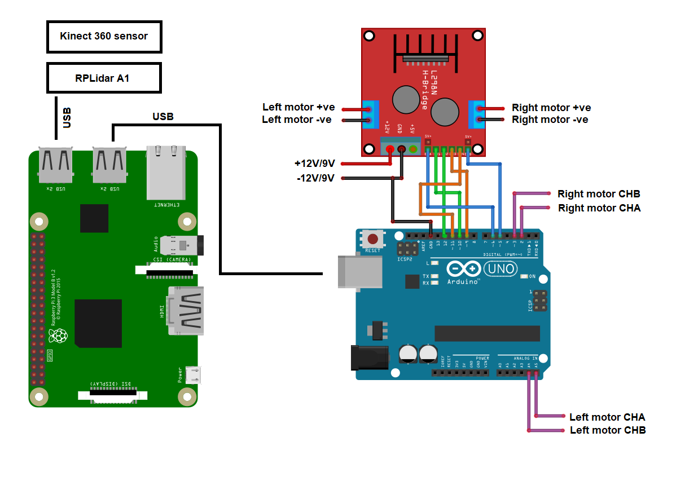

# RosBot (An Autonomous Navigation Project)

Autonomous driving is the current hot topic in automotive industry. The utilization of Simultaneous Localization and Mapping (SLAM) is commonly found in autonomous navigation. This project presents the idea of examining SLAM algorithms by implementing such an algorithm on a custom bot which has been fitted with sensors and microcontrollers. The software architecture is based on the Robot Operating System (ROS), an open-source framework designed to be used in robotic applications.

This Project covers, the examining of these algorithms in both simulations, and real-world experiments. The method used in this project is more related to v-development cycle, meaning that a near model of the vehicle is first implemented in simulations using each algorithm and followed by real world experiment.

This project has brought about a dynamic model of a small-scale bot which can be utilized for recreation of any ROS-compliant SLAM-algorithm, and this model has been used to compare diffrent SLAM algorithm with diffrent scenarios.

**_This Repository contains launch files for Gmapping, Hector Map and Rtab Map.
Please navigate through the readme files to know more about simulation and real-time implementation in respective folders_**

## Documentation

Click [here](https://github.com/hamsadatta/RosBot/wiki/1.-Understanding-ROS) for our article on ROS.

## video demo

https://www.youtube.com/watch?v=0BfArKlX1TU

## Hardware

## Circuit

## Compatability

Hardware and software used for this project:

Software

    ROS: Kinetic Kame

    OS:  Ubuntu 16.04

    SIM: Gazebo 7.0.0

Hardware

MASTER PC

    RAM: 8GB DDR4

    Storage: Samsung EVO SSD

    CPU: Intel i5 (8th Gen)

    GPU: Nvidia MX150 4GB

 REMOTE PC

    Raspberry pi3 B+

 OTHERS

    RP LIDAR A1M8

    Microsoft Kinect Sensor (first gen)

    SPG30E-200K DC Geared Motor with Encoder 17 RPM, 80 N.cm, 12V

    L298N 2A Based Motor Driver Module
    
    
 ## Credits

   [ hbrobotics/ros_arduino_bridge](https://github.com/hbrobotics/ros_arduino_bridge)
    
   [here]()
    
   [here]()
    
   [here]()
   
